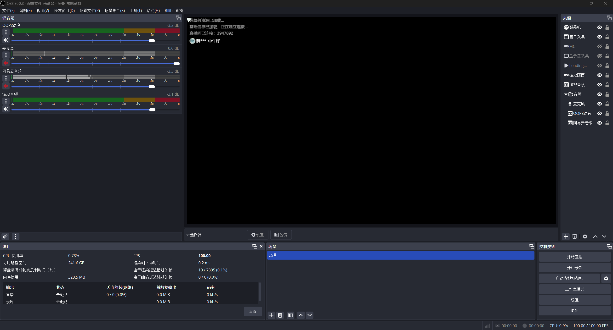
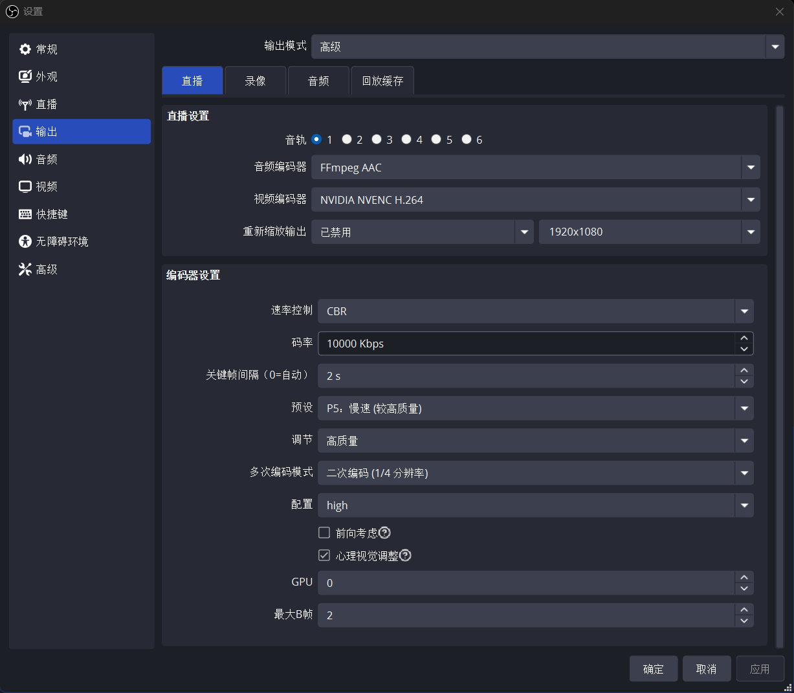
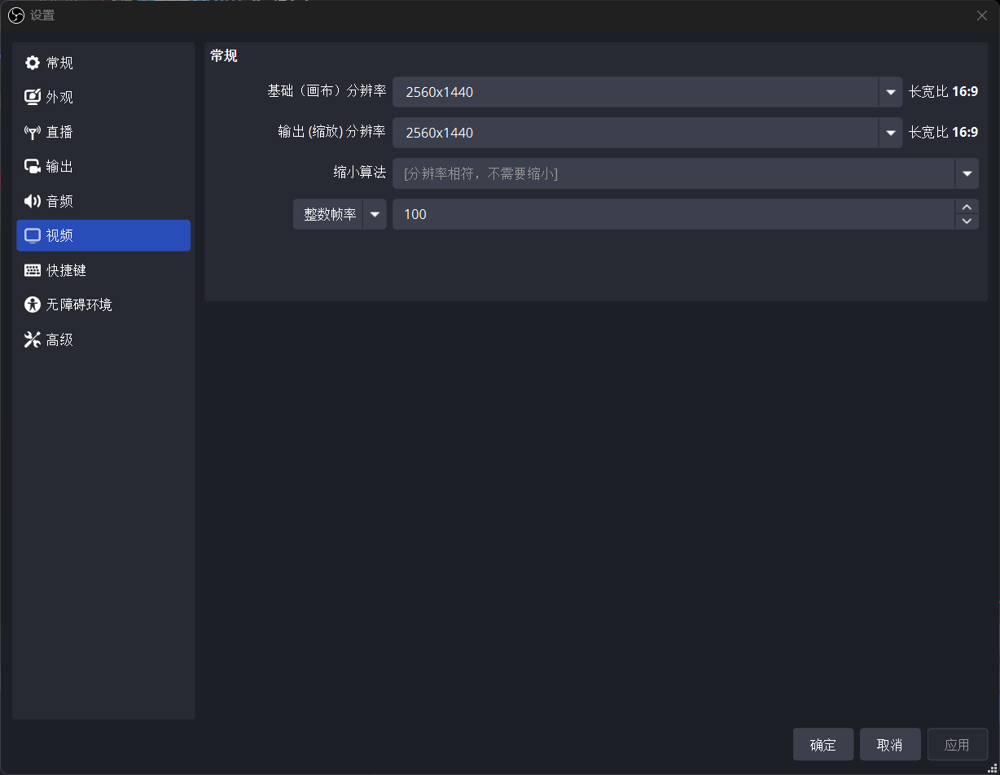
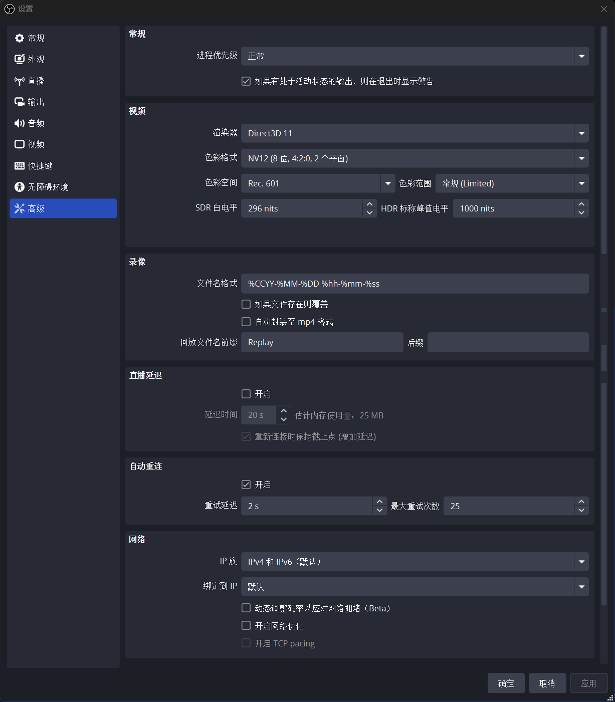
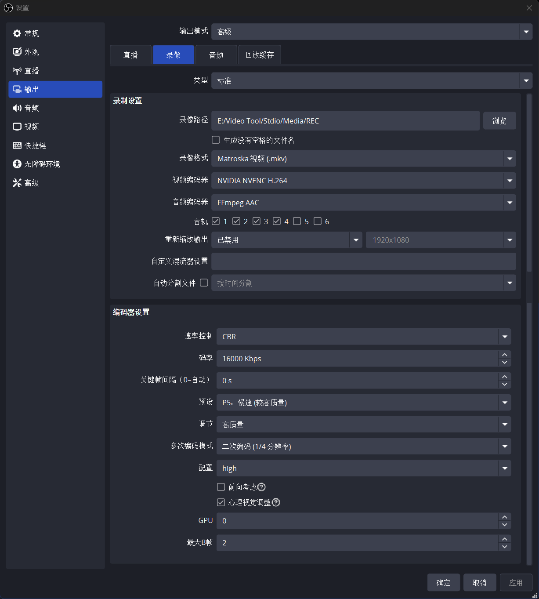
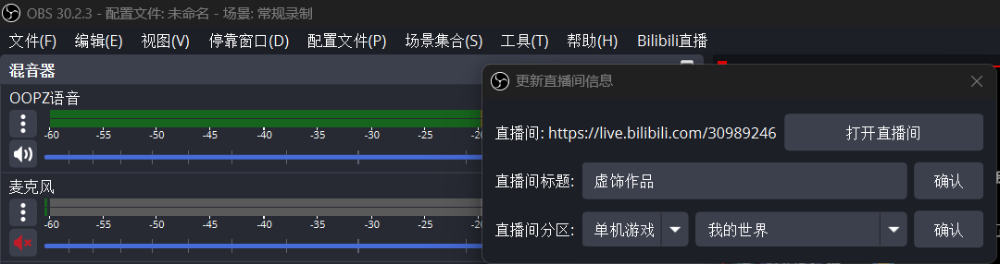
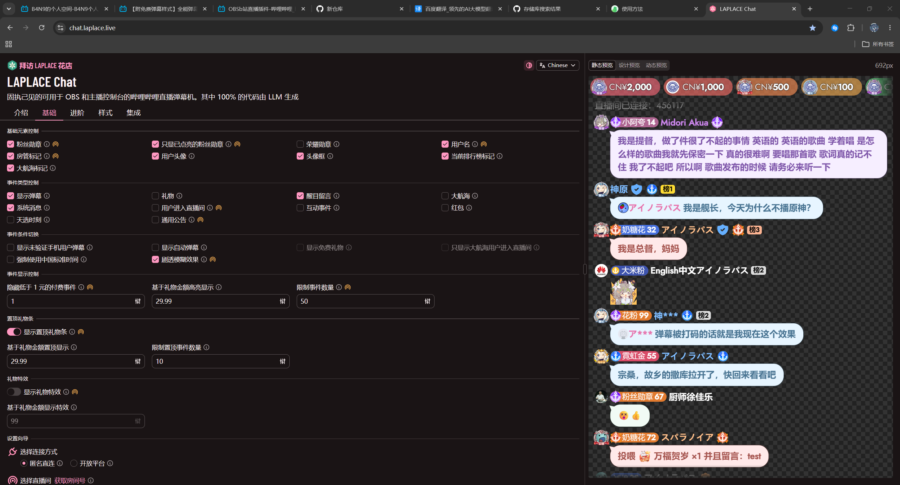
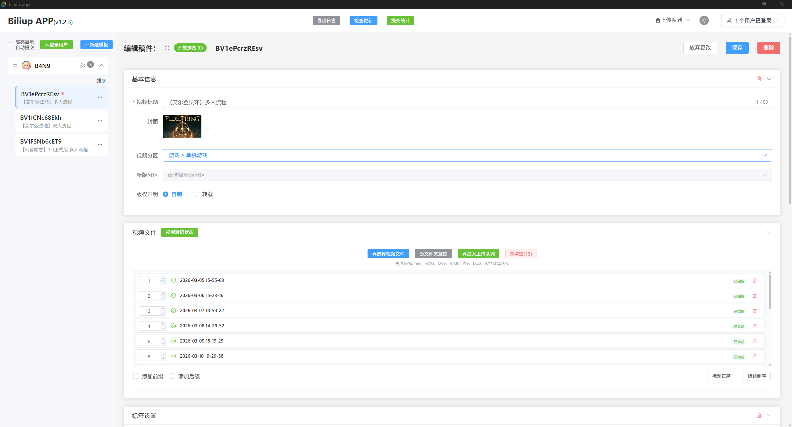

# OBS-Live4Bilibili-Settings

> 记录 OBS 设置、使用到的插件等，用于 Bilibili 直播与视频投稿的全流程配置参考。

本仓库记录了基于 OBS Studio 30.2.3 的 Bilibili 直播配置方案，通过插件实现**绕过哔哩哔哩直播姬直接用 OBS 推流**，并集成弹幕显示与视频投稿工具，覆盖从直播推流到录播投稿的完整工作流。

---

## 目录

- [OBS 场景配置](#obs-场景配置)
- [OBS 设置详情](#obs-设置详情)
  - [输出 - 直播](#输出---直播)
  - [视频](#视频)
  - [输出 - 录像](#输出---录像)
  - [高级](#高级)
- [使用到的插件](#使用到的插件)
  - [插件 1：obs-bilibili-stream](#插件-1obs-bilibili-stream)
  - [插件 2：LAPLACE Chat](#插件-2laplace-chat)
  - [插件 3：Biliup App](#插件-3biliup-app)
- [直播工作流程](#直播工作流程)
- [注意事项](#注意事项)

---

## OBS 场景配置




## OBS 设置详情

### 输出 - 直播



| 设置项 | 参数值 |
|:---|:---|
| 输出模式 | 高级 |
| 音轨 | 1 |
| 音频编码器 | FFmpeg AAC |
| 视频编码器 | NVIDIA NVENC H.264 |
| 速率控制 | CBR |
| 码率 | 10000 Kbps |
| 关键帧间隔 | 2 s |
| 预设 | P5：慢速（较高质量） |
| 调节 | 高质量 |
| 多次编码模式 | 二次编码（1/4 分辨率） |
| 配置 | high |
| 前向考虑 | 未勾选 |
| 心理视觉调整 | 已勾选 |
| GPU | 0 |
| 最大 B 帧 | 2 |

### 视频



| 设置项 | 参数值 |
|:---|:---|
| 基础（画布）分辨率 | 2560x1440 |
| 输出（缩放）分辨率 | 2560x1440 |
| 缩小算法 | 分辨率相符，不需要缩小 |
| 整数帧率 | 100 |

> 画布与输出分辨率一致，无需缩放，保证画质无损。

### 输出 - 录像



| 设置项 | 参数值 |
|:---|:---|
| 输出模式 | 高级 |
| 类型 | 标准 |
| 录像路径 | `E:/Video Tool/Stdio/Media/REC` |
| 录像格式 | Matroska 视频 (.mkv) |
| 视频编码器 | NVIDIA NVENC H.264 |
| 音频编码器 | FFmpeg AAC |
| 音轨 | 1、2、3 |
| 重新缩放输出 | 已禁用 |
| 自动分割文件 | 未勾选 |
| 速率控制 | CBR |
| 码率 | 16000 Kbps |
| 关键帧间隔 | 0 s（自动） |
| 预设 | P5：慢速（较高质量） |
| 调节 | 高质量 |
| 多次编码模式 | 二次编码（1/4 分辨率） |
| 配置 | high |
| 心理视觉调整 | 已勾选 |
| GPU | 0 |
| 最大 B 帧 | 2 |

> 录像码率（16 Mbps）高于直播码率（10 Mbps），兼顾直播流畅度与录播画质。MKV 封装容错性好，适合长时间录制。启用 3 轨音频为后期编辑预留空间。

### 高级



#### 常规

| 设置项 | 参数值 |
|:---|:---|
| 进程优先级 | 正常 |
| 退出时显示警告（有活动输出时） | 已勾选 |

#### 视频

| 设置项 | 参数值 |
|:---|:---|
| 渲染器 | Direct3D 11 |
| 色彩格式 | NV12（8 位, 4:2:0, 2 个平面） |
| 色彩空间 | Rec. 601 |
| 色彩范围 | 常规 (Limited) |
| SDR 白电平 | 296 nits |
| HDR 标称峰值电平 | 1000 nits |

#### 录像

| 设置项 | 参数值 |
|:---|:---|
| 文件名格式 | `%CCYY-%MM-%DD %hh-%mm-%ss` |
| 如果文件存在则覆盖 | 未勾选 |
| 自动封装至 mp4 格式 | 未勾选 |
| 回放文件名前缀 | Replay |

#### 直播延迟

| 设置项 | 参数值 |
|:---|:---|
| 开启 | 未勾选 |
| 延迟时间 | 20 s（未启用） |
| 估计内存使用量 | 25 MB |

#### 自动重连

| 设置项 | 参数值 |
|:---|:---|
| 开启 | 已勾选 |
| 重试延迟 | 2 s |
| 最大重试次数 | 25 |

#### 网络

| 设置项 | 参数值 |
|:---|:---|
| IP 族 | IPv4 和 IPv6（默认） |
| 绑定到 IP | 默认 |
| 动态调整码率以应对网络拥堵 (Beta) | 未勾选 |
| 开启网络优化 | 未勾选 |
| 开启 TCP pacing | 未勾选 |

---

## 使用到的插件

### 插件 1：obs-bilibili-stream



- **仓库地址**：<https://github.com/Zarosmm/obs-bilibili-stream>
- **当前版本**：2.1.1
- **许可证**：GPL-2.0

#### 功能简介

OBS Studio 的 Bilibili 直播插件，用于**绕过哔哩哔哩直播姬**，直接在 OBS 中完成 Bilibili 直播推流。无其他软件和粉丝数要求。

核心功能：

- 扫码登录 Bilibili 账号
- 在 OBS 内直接更新直播间标题、分区信息
- 自动获取 RTMP 推流地址和推流码
- 通过 OBS 菜单栏 `Bilibili 直播` 一键管理直播流程

#### 安装方法

1. 从 [Releases 页面](https://github.com/Zarosmm/obs-bilibili-stream/releases) 下载最新 `bilibili-stream-for-obs-*-windows-x64.zip`
2. 解压后将文件夹移动至 `C:\ProgramData\obs-studio\plugins`
3. 确保目录结构如下：
   ```
   C:\ProgramData\obs-studio\plugins\
   └── bilibili-stream-for-obs\
       ├── bin\
       │   └── 64bit\
       │       └── bilibili-stream-for-obs.dll
       └── data\
           └── locale\
               └── (相关的 .ini 语言文件)
   ```
4. 重启 OBS Studio，菜单栏将出现 `Bilibili 直播` 选项

#### 使用流程

1. **登录**：`Bilibili 直播` → `登录` → 扫码登录
2. **更新直播间信息**：`Bilibili 直播` → `更新直播间信息` → 设置标题、分区
3. **开始直播**：`Bilibili 直播` → `开始直播` → 复制 RTMP 地址和推流码 → 填入 OBS `设置` → `输出` → `流`
4. **结束直播**：OBS 点击 `停止直播` → `Bilibili 直播` → `停止直播`

> 详细安装与使用说明（含 macOS / Linux）请参阅 [插件官方 README](https://github.com/Zarosmm/obs-bilibili-stream/blob/master/README.md)。

---

### 插件 2：LAPLACE Chat



- **网址**：<https://chat.laplace.live/>
- **类型**：网页应用（无需安装，OBS 浏览器源接入）

#### 功能简介

哔哩哔哩直播弹幕机，实现在直播画面中添加弹幕显示，并在网页端汇总直播间弹幕信息。其中 100% 的代码由 LLM 生成。

核心功能：

- 弹幕、醒目留言（SC）、礼物等事件实时显示
- 粉丝勋章、房管标记、大航海标记、排行榜标记等元素控制
- 置顶礼物条、礼物特效展示
- 基于礼物金额的高亮与特效阈值自定义
- 事件数量限制与付费事件过滤
- 支持匿名直连 / 开放平台两种连接方式
- 可视化样式自定义（CSS）

#### 配置参考（基础标签页）

| 配置区块 | 已启用项 |
|:---|:---|
| 基础元素控制 | 粉丝勋章、房管标记、大航海标记、只显示亮灯的粉丝勋章、用户名、用户头像、头像框、当前排行榜标记 |
| 事件类型 | 弹幕、醒目留言 |
| 事件显示控制 | 显示自动弹幕 |
| 数值设置 | 隐藏低于 1 元的付费事件、礼物高亮阈值 29.99、限制事件数量 50 |
| 置顶礼物条 | 已开启（阈值 29.99，限制 10 条） |
| 礼物特效 | 已开启（阈值 59） |
| 连接方式 | 开放平台 |

#### OBS 接入方法

1. 在 <https://chat.laplace.live/> 完成配置
2. 选择连接方式（推荐开放平台）并输入直播间房间号
3. 复制生成的 OBS 弹幕机链接
4. 在 OBS 中添加 `浏览器源`，粘贴链接
5. 调整浏览器源的尺寸与层级位置（弹幕层置于游戏画面之上）

> 详细使用方法请访问 [插件官网](https://chat.laplace.live/) 的「介绍」与「使用方法」页面。

---

### 插件 3：Biliup App



- **仓库地址**：<https://github.com/biliup/biliup-app-new>
- **当前版本**：v1.2.3
- **技术栈**：Tauri + Vue 3
- **许可证**：Apache-2.0 / MIT（双协议）

#### 功能简介

B 站视频上传管理工具，可上传长视频、分 P 视频，支持多账号投稿等强大功能。适合游戏录播等连载型内容的批量投稿。

核心功能：

- **视频管理**：拖拽上传、批量处理、文件夹监控自动上传
- **模板系统**：可复用模板、一键重置、从现有视频复制配置
- **编辑稿件**：联合投稿、简介 @好友、稿件状态显示、多稿件同步投稿
- **多账号支持**：多个 B 站账号同时登录管理
- **分 P 自动排序**：按时间戳命名文件自动识别并排序

#### 下载安装

从 [Release 页面](https://github.com/biliup/biliup-app-new/releases) 下载对应平台的安装包。

#### 快捷键

| 快捷键 | 功能 |
|:---|:---|
| Ctrl + S | 保存当前模板 |
| Ctrl + R | 重置模板到保存前状态 |
| Ctrl + F5 | 刷新应用页面 |

#### 系统要求

| 平台 | 要求 |
|:---|:---|
| Windows | Windows 10 及以上 |
| macOS | macOS 10.15 及以上 |
| Linux | 现代 Linux 发行版 |

> 详细功能说明请参阅 [插件官方 README](https://github.com/biliup/biliup-app-new/blob/master/README.md)。

---

## 直播工作流程

```
┌─────────────────────────────────────────────────────────┐
│                     直播前准备                           │
├─────────────────────────────────────────────────────────┤
│  1. 启动 OBS Studio                                     │
│  2. 菜单 Bilibili直播 → 登录（扫码）                     │
│  3. 菜单 Bilibili直播 → 更新直播间信息（标题/分区）       │
│  4. 菜单 Bilibili直播 → 开始直播（获取 RTMP 地址/推流码） │
│  5. OBS 设置 → 输出 → 流 → 填入 RTMP 地址和推流码        │
│  6. 在 OBS 添加浏览器源 → 粘贴 LAPLACE Chat 弹幕链接     │
└─────────────────────┬───────────────────────────────────┘
                      ▼
┌─────────────────────────────────────────────────────────┐
│                     直播中                              │
├─────────────────────────────────────────────────────────┤
│  · OBS 点击「开始直播」按钮推流                          │
│  · 通过来源可见性切换游戏画面/转场画面                    │
│  · 混音器调节各通道音量                                  │
│  · LAPLACE Chat 实时显示弹幕                            │
└─────────────────────┬───────────────────────────────────┘
                      ▼
┌─────────────────────────────────────────────────────────┐
│                     直播后                              │
├─────────────────────────────────────────────────────────┤
│  1. OBS 点击「停止直播」                                │
│  2. 菜单 Bilibili直播 → 停止直播（关闭直播间）            │
│  3. 使用 Biliup App 上传录播视频                         │
│     · 导入录像文件（MKV）                               │
│     · 设置标题/封面/分区/标签                            │
│     · 分 P 自动排序                                     │
│     · 加入上传队列投稿                                  │
└─────────────────────────────────────────────────────────┘
```

---

## 注意事项

- **OBS 版本**：本配置基于 OBS Studio 30.2.3，obs-bilibili-stream 插件要求 OBS 30.0 或更高版本
- **硬件要求**：视频编码使用 NVIDIA NVENC H.264，需要 NVIDIA 显卡支持；2K@100FPS 直播对 GPU 编码能力有一定要求
- **网络要求**：直播码率 10 Mbps，需保证稳定上行带宽；自动重连已启用（2 秒间隔，最多 25 次）
- **录像格式**：使用 MKV 封装，如需 MP4 格式可在直播结束后通过 OBS `文件 → 录像重新封装` 转换
- **插件更新**：建议定期检查各插件 Release 页面获取最新版本
- **Biliup 已知问题**：上传时如果持续不更新进度，删除任务后手动切换线路再上传
